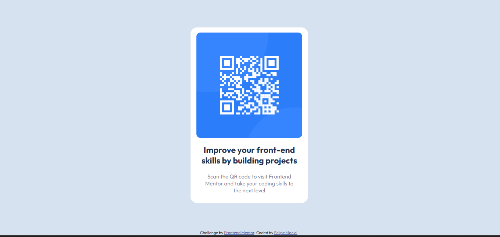

# Frontend Mentor - QR code component solution

This is a solution to the [QR code component challenge on Frontend Mentor](https://www.frontendmentor.io/challenges/qr-code-component-iux_sIO_H). Frontend Mentor challenges help you improve your coding skills by building realistic projects. 

## Table of contents

- [Overview](#overview)
  - [Screenshot](#screenshot)
  - [Links](#links)
- [My process](#my-process)
  - [Built with](#built-with)
  - [What I learned](#what-i-learned)
  - [Useful resources](#useful-resources)
- [Author](#author)

**Note: Delete this note and update the table of contents based on what sections you keep.**

## Overview

### Screenshot

### Links

- Solution URL: [Add solution URL here](https://felipe1000.github.io/qr-code/)

## My process

### Built with

- Semantic HTML5 markup
- CSS custom properties
- Flexbox
- CSS Grid

### What I learned
Some Flexbox settings I hadn't used yet, like centering and column alignment.

### Useful resources

- [Stackover Flow](https://pt.stackoverflow.com/) - It helps me when searching for any suggestions or tips.
- [Pomofocus](https://pomofocus.io/) - It helps to stay focused on studies and tasks with the pomodoro technique. Time used for the elaboration of this project 125 me.

## Author

- Website - [Add your name here](https://felipeguedesmaciel.000webhostapp.com)
- Frontend Mentor - [@yourusername](https://www.frontendmentor.io/profile/felipe1000)